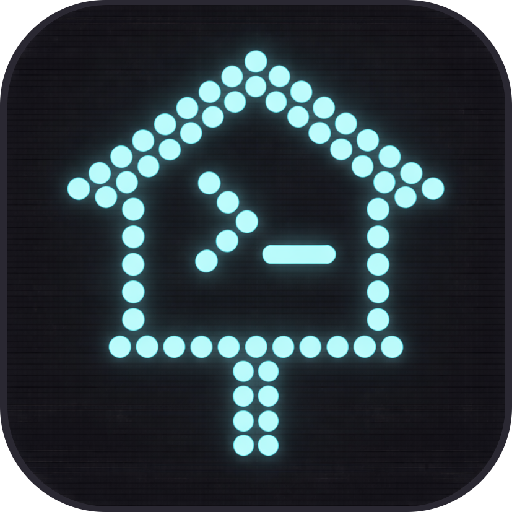

<div align="center">
  
  <h1>Roost</h1>
  <p>A self-hosted terminal that lives on your server and runs on every device.</p>

  [](LICENSE)
  [](docker-compose.yml)
  [](api/api.py)
  [](web/manifest.json)
</div>

---

Your terminal is open on your phone. The session is alive on your server. Close the browser — it keeps running. Open it on your laptop — same session, same history, same scrollback. That's Roost.

It runs on a Mac Mini or any always-on host inside Docker. Reach it from anywhere: on LAN through Caddy, remotely through Tailscale. No subscriptions. No cloud. Nothing leaves your machine.

> **Screenshots and GIFs welcome.** If you set this up and want to contribute visuals to the README, open a PR.

---

## Contents

- [Architecture](#architecture)
- [Features](#features)
- [Why Roost?](#why-roost)
- [Use Cases](#use-cases)
- [Prerequisites](#prerequisites)
- [Directory Structure](#directory-structure)
- [Setup](#setup)
- [Accessing the UI](#accessing-the-ui)
- [Using the Terminal](#using-the-terminal)
- [Session Logs](#session-logs)
- [API Reference](#api-reference)
- [Database Schema](#database-schema)
- [Development](#development)
- [Troubleshooting](#troubleshooting)
- [Tech Stack](#tech-stack)
- [Contributing](#contributing)

---

## Architecture

```
┌──────────────┐   ┌──────────────┐   ┌──────────────┐
│   Laptop     │   │   Phone      │   │  Other PC    │
│  (browser)   │   │ (Safari PWA) │   │  (browser)   │
└──────┬───────┘   └──────┬───────┘   └──────┬───────┘
       └──────────┬───────┴───────────────────┘
                  │  LAN / Tailscale (VPN)
                  ▼
       ┌──────────────────────────────────────┐
       │           Mac Mini (Docker)          │
       │                                      │
       │  caddy-proxy (standalone container)  │
       │    https://ai.home → :7682 (web UI)  │
       │    /ttyd/* → :7681 + :7690–7699      │
       │                                      │
       │  roost-web  (:7682)           │
       │    serves index.html + assets        │
       │                                      │
       │  roost-ttyd (:7681, :7683)    │
       │    ttyd     — main terminal shell    │
       │    api.py   — REST API (:7683)       │
       │    per-project ttyd (:7690–7699)     │
       │    SQLite   — interaction history    │
       └──────────────────────────────────────┘
```

**DNS:** Pi-hole maps `ai.home` → Mac Mini LAN IP  
**TLS:** mkcert cert managed by the standalone `caddy-proxy`  
**Remote access:** Tailscale connects devices outside the home network  

---

## Features

- **Multi-project terminals** — each project gets an isolated tmux session and a ttyd instance on a dedicated port (7690–7699)
- **Mobile-optimised PWA** — installable via "Add to Home Screen"; keyboard toolbar with Esc, Tab, Ctrl, Alt, arrows, and combos
- **Key repeat** — hold any key on the custom keyboard or toolbar to repeat at 80ms intervals after a 400ms delay
- **Session logging** — every terminal session is recorded automatically via tmux `pipe-pane` to flat files, browsable from the History tab
- **Command snippets** — saved commands that inject directly into the terminal
- **Connection recovery** — auto-reconnects on network drop or app background; force-reconnects after >5s in background
- **Catppuccin Mocha** — consistent theme across terminal, UI chrome, and toolbar
- **Berkeley Mono Nerd Font** — optional; falls back to JetBrains Mono → Fira Code → system monospace

---

## Why Roost?

Most mobile terminal apps either cost money, lock you to one platform, or drop your session when you close the app. Roost runs *on your server* — the session lives there, and any browser is just a window into it.

|  | **Roost** | Termius | Blink Shell | JuiceSSH | Raw SSH |
|---|---|---|---|---|---|
| Self-hosted | ✅ | ❌ | ❌ | ❌ | ✅ |
| Free | ✅ MIT | Freemium | $20 | Freemium | ✅ |
| Works on any device | ✅ browser | ✅ | iOS only | Android only | With client |
| Persistent sessions | ✅ tmux | ❌ | ❌ | ❌ | With tmux |
| Custom mobile keyboard | ✅ | ❌ | Limited | ❌ | ❌ |
| Session recording | ✅ | ❌ | ❌ | ❌ | ❌ |
| Multi-project isolation | ✅ | ❌ | ❌ | ❌ | ❌ |
| No cloud dependency | ✅ | ❌ | ❌ | ❌ | ✅ |

---

## Use Cases

**Homelab from the couch.** Each project gets its own tmux session. Switch between them from your phone without losing context.

**Check on a long build.** Start a job on your server. Close the laptop. Open Roost on your phone an hour later — session still running, logs still scrolling.

**Always-on AI assistant.** Mount your dev directory into the container. Keep a session with your AI tools running. Pick it back up from any device.

**Remote access from anywhere.** Tailscale connects your devices over a mesh VPN. Roost is accessible on the same `ai.home` URL whether you're home or not.

**One keyboard layout for every device.** Configure your key toolbar once. It syncs across devices via the API — your Esc, Tab, and arrow keys are always where you put them.

---

## Prerequisites

| Requirement | Notes |
|---|---|
| Mac Mini (or always-on Linux host) | The execution hub; everything runs here |
| Docker Desktop | For the container stack |
| Standalone `caddy-proxy` container | Pre-existing; handles TLS for all `*.home` domains |
| Pi-hole | Provides `ai.home` DNS record |
| Tailscale | For remote access outside the home network |
| Berkeley Mono Nerd Font `.woff2` or `.ttf` *(optional)* | Licensed; must be supplied by you |

---

## Directory Structure

```
roost/
├── api/
│   └── api.py              # Python REST API (BaseHTTPRequestHandler, port 7683)
├── assets/
│   └── fonts/              # Place BerkeleyMonoNerdFont-Regular.{woff2,ttf} here
├── bin/
│   ├── copilot-wrap        # Legacy shell wrapper (kept for reference)
│   └── copilot-history     # Legacy CLI tool (replaced by web log viewer)
├── config/
│   ├── zshrc               # Zsh config baked into container image
│   ├── bashrc              # Bash config baked into container image
│   └── tmux.conf           # Tmux status bar (Catppuccin Mocha, minimal)
├── db/
│   └── schema.sql          # SQLite schema (snippets, settings, projects)
├── docs/
│   ├── plans/              # Design documents for major features
│   └── working-from-anywhere.md  # How to SSH into a laptop from the terminal
├── lib/
│   └── logger.sh           # Legacy logging library (kept for reference)
├── logs/                   # Session logs (auto-recorded via tmux pipe-pane)
│   ├── _main/              # Main shell logs
│   └── {project-slug}/     # Per-project logs
├── services/
│   ├── Caddyfile           # ai.home block for the standalone caddy-proxy
│   └── web.Caddyfile       # Caddy config for the roost-web container
├── web/
│   ├── index.html          # Single-file PWA (~4900 lines, all CSS + JS inline)
│   ├── manifest.json       # PWA manifest (icons, display: standalone)
│   └── icons/              # App icons: 32×32, 192×192, 512×512
├── CLAUDE.md               # Architecture reference (for AI assistants)
├── COPILOT_INSTRUCTIONS.md # AI-specific codebase guide
├── .env.example            # Configuration template — copy to .env and edit
├── Dockerfile              # debian:bookworm-slim; installs ttyd, gh, oh-my-zsh
├── docker-compose.yml      # Two services: ttyd (app) + web (Caddy file server)
├── entrypoint.sh           # Container start: checks gh auth, launches api.py
├── install.sh              # Host machine installer (copies files, initialises DB)
├── Makefile                # Common operations: setup, up, build, logs, shell, auth
└── SETUP.md                # Full step-by-step setup walkthrough
```

---

## Setup

See **[SETUP.md](SETUP.md)** for the full walkthrough. The short version:

### 1. Configure

```bash
cp .env.example .env
```

Edit `.env`:

```bash
HOST=mac-mini      # hostname of the machine running Docker
DOMAIN=ai.home     # domain you'll use to access the UI
DEV_DIR=~/Dev      # local directory to mount as /mnt/dev inside the container
```

### 2. DNS — Pi-hole

Add a local DNS record in Pi-hole admin → **Local DNS → DNS Records**:
- Domain: `ai.home` (or whatever you set `DOMAIN` to)
- IP: the machine's LAN IP (`ipconfig getifaddr en0` on macOS)

### 3. TLS — mkcert cert

On the machine where `caddy-proxy` is managed:

```bash
mkcert ai.home
mv ai.home.pem       /path/to/caddy/certs/ai.home.pem
mv ai.home-key.pem   /path/to/caddy/certs/ai.home-key.pem
```

Add the `ai.home` block from `services/Caddyfile` into your `caddy-proxy` Caddyfile, then restart it.

### 4. Font — Berkeley Mono Nerd Font (optional)

Copy the Regular weight into the assets directory:

```bash
cp BerkeleyMonoNerdFont-Regular.woff2 ~/.roost/assets/fonts/
# .ttf also works; filename must start with BerkeleyMonoNerdFont-Regular
```

The UI falls back to JetBrains Mono → Fira Code → system monospace if the font is absent.

### 5. First-time start

```bash
make setup
```

This creates the Docker network, builds and starts the containers.

If the container was already running when you cloned:
```bash
make build    # rebuild image
```

### 6. Custom packages (optional)

To add tools to the container image (gh CLI, Node.js, pip packages, etc.), edit `config/packages.sh` and rebuild:

```bash
cp config/packages.sh.example config/packages.sh
# Uncomment the sections you want, then:
make build
```

---

## Accessing the UI

| Device | URL | Notes |
|---|---|---|
| Laptop / desktop | `https://ai.home` | LAN or Tailscale |
| Phone (iOS) | `https://ai.home` → Share → Add to Home Screen | Full-screen PWA |
| Phone (Android) | `https://ai.home` → Install app | Full-screen PWA |
| Remote (Tailscale) | `https://ai.home` via Tailscale | Works anywhere |

### First visit — trust the mkcert CA

```bash
mkcert -install   # desktop/laptop
```

On iOS: import the mkcert root CA profile → Settings → General → VPN & Device Management → trust it.

---

## Using the Terminal


### Projects

- Tap **＋** to create a project (name, directory path, colour)
- Each project opens its own tmux session; closing the browser doesn't kill it
- Tap the project card to connect; the terminal loads in the browser
- Multiple shells per project — use the tmux window tabs inside the terminal

### Custom keyboard (mobile)

The panel at the bottom has two layouts (toggle with the compact/full button):

- **Full:** 7 rows of configurable keys
- **Compact:** 4 rows

Long-press any key to edit its label, value, and type. Drag to reorder.  
Hold a key to repeat it (400ms initial delay, 80ms interval).

### Shortcut bar (always visible)

Fixed row above the keyboard/panel: `↵ Enter`, `Ctrl`, `Alt`, `^C`, `◀ ▲ ▼ ▶`.  
Arrow keys and Enter support hold-to-repeat.

### Command snippets

Saved commands in the Snippets tab — tap to inject into the terminal.

---

## Session Logs

Every terminal session is recorded automatically via tmux `pipe-pane`. Logs are stored as flat files in `~/.roost/logs/{project-slug}/`.

Browse and search session logs from the **History** tab in the UI. Tap a session card to open the log viewer with client-side search. Active sessions show a live-updating tail.

### Log API

| Method | Path | Description |
|--------|------|-------------|
| `GET` | `/api/logs` | List all log files (newest first, grouped by project) |
| `GET` | `/api/logs/:project/:file` | Raw log content (`?tail=N` for last N lines) |
| `GET` | `/api/logs/current/:project` | Tail active session (last 200 lines) |
| `GET` | `/api/logs/search?q=term` | Search across all logs (grep, ANSI-stripped excerpts) |

---

## API Reference

The Python API runs on port **7683** inside the container. All responses are JSON.

### Health

| Method | Path | Description |
|--------|------|-------------|
| `GET` | `/api/health` | Returns `{"ok": true}` |

### Projects

| Method | Path | Description |
|--------|------|-------------|
| `GET` | `/api/projects` | List all projects |
| `POST` | `/api/projects` | Create project `{name, directory, color}` |
| `GET` | `/api/projects/:id` | Get project |
| `PUT` | `/api/projects/:id` | Update project |
| `DELETE` | `/api/projects/:id` | Delete project and stop ttyd |
| `POST` | `/api/projects/:id/start` | Start ttyd → `{port}` |
| `POST` | `/api/projects/:id/stop` | Stop ttyd (tmux session kept) |
| `GET` | `/api/projects/activity` | Activity status for all projects (for badge polling) |
| `PUT` | `/api/projects/:id/viewed` | Mark project as viewed (clears activity badge) |

### Shells (tmux windows per project)

| Method | Path | Description |
|--------|------|-------------|
| `GET` | `/api/projects/:id/shells` | List tmux windows `[{index, name, active}]` |
| `POST` | `/api/projects/:id/shells` | Create new window → `{index}` |
| `DELETE` | `/api/projects/:id/shells/:n` | Kill window n |

### Snippets

| Method | Path | Description |
|--------|------|-------------|
| `GET` | `/api/snippets` | List all snippets |
| `POST` | `/api/snippets` | Create `{name, command}` |
| `PUT` | `/api/snippets/:id` | Update snippet |
| `DELETE` | `/api/snippets/:id` | Delete snippet |

### Settings

| Method | Path | Description |
|--------|------|-------------|
| `GET` | `/api/settings/layout` | Get custom keyboard layout (JSON) |
| `PUT` | `/api/settings/layout` | Save keyboard layout |
| `GET` | `/api/settings/compact-layout` | Get compact layout |
| `PUT` | `/api/settings/compact-layout` | Save compact layout |

### Uploads

| Method | Path | Description |
|--------|------|-------------|
| `POST` | `/api/upload-image` | Upload base64 image → `{path, url, filename}` |
| `GET` | `/api/uploads` | List recent uploads (last 10) |
| `GET` | `/api/uploads/:filename` | Serve upload |

### History export (legacy)

| Method | Path | Description |
|--------|------|-------------|
| `GET` | `/api/export` | Export all interactions as JSON (legacy — from copilot-logging era) |

### Session Logs

| Method | Path | Description |
|--------|------|-------------|
| `GET` | `/api/logs` | List all log files (newest first) |
| `GET` | `/api/logs/:project/:file` | Raw log content (`?tail=N` for last N lines) |
| `GET` | `/api/logs/current/:project` | Tail active session (last 200 lines) |
| `GET` | `/api/logs/search?q=term` | Search across all logs |

---

## Database Schema

SQLite at `~/.roost/db/history.db`. Schema lives in `db/schema.sql`.

**`projects`** — name, directory, color, sort order, last active timestamp  
**`snippets`** — saved commands  
**`settings`** — key/value store for keyboard layout and UI preferences  
**`sessions`** / **`interactions`** — legacy tables from the copilot-logging era (not used by current code)  

Session logs are stored as flat files in `~/.roost/logs/`, not in the database.

---

## Development

The repo lives on your server (the machine running Docker). All services mount files directly from the repo via bind mounts — `web/` into the web container, `api/api.py` into the ttyd container. This means a `git pull` on the server is the deploy step for most changes.

### Updating and deploying

Edit files on any machine, commit, and push. Then on the server:

```bash
cd /path/to/roost          # wherever you cloned the repo
git pull
```

That's it for web and API changes — the containers read directly from the repo. For changes that touch the Docker image itself, rebuild after pulling:

| What changed | Deploy command |
|---|---|
| `web/index.html`, icons, manifest | `git pull` — refresh browser |
| `api/api.py` | `git pull && make restart` |
| `Dockerfile`, `entrypoint.sh`, `config/` | `git pull && make build` |
| `docker-compose.yml` | `git pull && make down && make up` |

### Common commands (via `make`)

```bash
make up          # start all services
make down        # stop all services
make restart     # restart ttyd only (picks up api.py changes — no rebuild needed)
make build       # full rebuild (only needed after Dockerfile / config/ changes)
make logs        # tail logs for all services
make shell       # open a Zsh shell inside the container
make ps          # show container status
```

### What's mounted where

| Repo path | Container path | Service | Hot-reload? |
|---|---|---|---|
| `./web/` | `/srv/web` | roost-web | Yes — refresh browser |
| `./api/api.py` | `/app/api.py` | roost-ttyd | `make restart` |
| `./services/web.Caddyfile` | `/etc/caddy/Caddyfile` | roost-web | `make restart` |

Runtime data lives outside the repo in `~/.roost/`:

| Host path | Container path | Purpose |
|---|---|---|
| `~/.roost/` | `/root/.roost` | SQLite DB, logs, uploads |
| `~/.roost/assets/` | `/srv/assets` | Fonts (not in repo — user-provided) |

### Ports (inside container / on Mac Mini LAN)

| Port | Service |
|------|---------|
| 7681 | ttyd — default shell (exposed to Caddy) |
| 7682 | Caddy web server — serves index.html and assets |
| 7683 | Python API |
| 7690–7699 | Per-project ttyd instances (allocated dynamically) |

---

## Troubleshooting

| Problem | Fix |
|---|---|
| Can't reach `https://ai.home` | Check Pi-hole DNS record. Verify `caddy-proxy` is running: `docker ps`. Try Mac Mini's LAN IP directly. |
| Browser shows cert warning | Run `mkcert -install` on the client, or import the mkcert root CA on iOS. |
| Terminal loads but no input | Ensure ttyd is running with `--writable` (it is by default in Dockerfile). |
| First Docker build is slow | Normal — downloads ~200 MB of packages. Watch with `docker compose logs -f ttyd`. |
| Phone keyboard covers terminal | Open as a PWA ("Add to Home Screen"). The shortcut bar handles Esc/Tab/Ctrl without the native keyboard. |
| History tab empty | Start a project — session logging begins when a tmux session spawns. Check `~/.roost/logs/` for log files. |
| "Press ↵ to Reconnect" stuck | Tap it — it should reconnect. If it doesn't, quit and reopen the PWA. The overlay auto-dismisses once the WebSocket is established. |
| Container keeps restarting | Check `docker compose logs ttyd` for startup errors, usually a missing volume or DB permission issue. |

---

## Tech Stack

| Layer | Technology | Why |
|---|---|---|
| Terminal server | [ttyd](https://github.com/tsl0922/ttyd) | Single binary, xterm.js frontend, WebSocket protocol |
| Shell | Zsh + Oh My Zsh + Spaceship | Familiar, plugin ecosystem, git-aware prompt |
| Multiplexer | tmux | One session per project; survives disconnects |
| API | Python stdlib (`BaseHTTPRequestHandler`) | Zero dependencies, runs anywhere |
| Storage | SQLite + FTS5 | Single file, full-text search built in |
| Frontend | Vanilla JS + xterm.js | No build step; inline CSS + JS in one file |
| Theme | [Catppuccin Mocha](https://github.com/catppuccin/catppuccin) | Consistent palette, works well in terminals |
| Font | Berkeley Mono Nerd Font | Licensed; Nerd-patched for terminal glyphs |
| Reverse proxy | [Caddy](https://caddyserver.com/) | Auto TLS, simple config, shared with other home services |
| Remote access | [Tailscale](https://tailscale.com/) | Zero-config mesh VPN, iOS/Android apps |
| DNS | Pi-hole | Local `ai.home` record; already running |
| Containerisation | Docker Compose | Two services; `restart: unless-stopped` |

---

## Contributing

Screenshots, GIFs, and bug reports are the most useful contributions right now. If you run Roost and want to share a screenshot or screen recording, open a PR adding them to `assets/`.

For code contributions, see [CONTRIBUTING.md](CONTRIBUTING.md).
