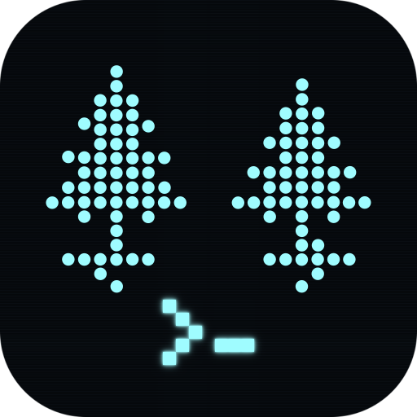
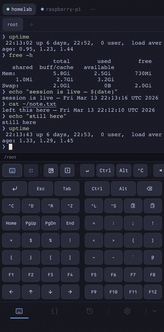
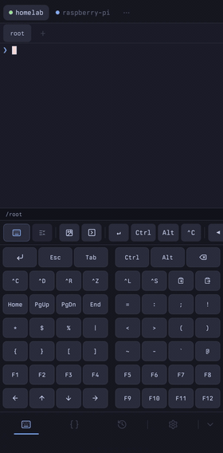
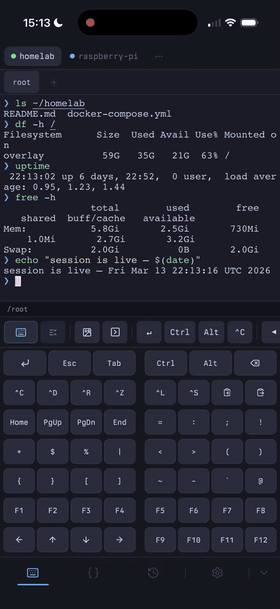

<div align="center">
  
  <h1>Glade.sh</h1>
  <p>A self-hosted terminal that runs on your server and is accessible from any device.<br>Sessions persist through browser closes and laptop shutdowns — useful for long-running AI agents and background work.</p>

  [](LICENSE)
  [](docker-compose.yml)
  [](api/api.py)
  [](web/manifest.json)
</div>

---

Glade is a self-hosted terminal that runs inside Docker on an always-on host. Sessions are managed by tmux on the server, so they persist across browser closes and device switches — close the browser on your laptop, reopen on your phone, and the session, history, and scrollback are all still there.

It runs on any always-on host — a Mac Mini, Raspberry Pi, Linux server, or Windows machine. Access it over LAN via Caddy or remotely via Tailscale. No subscriptions, no cloud, nothing leaves your machine.

It's also a practical fit for AI coding tools. Running Claude Code, GitHub Copilot, or similar directly on the server means the agent is isolated inside Docker — it only has access to what's in the container, not your local files or personal data. Long-running jobs keep going after you close the laptop; check back from any device when they're done.

---

<table>
<tr>
<td rowspan="2" valign="top" width="55%">

### GitHub projects in seconds

Connect GitHub in Settings. Search a repo, tap Create — you're already inside it. No manual cloning.


</td>
<td valign="top">

### A real terminal

Full shell on your server. Run anything.


</td>
</tr>
<tr>
<td valign="top">

### Sessions that stick

Close the browser. Switch devices. Come back — your session is still there.


</td>
</tr>
</table>

---

## Quick Start

```bash
git clone https://github.com/mattsimonis/glade-sh
cd glade
cp .env.example .env   # set HOST= to your server's hostname
```

Add the `glade.local` block from `services/Caddyfile` to your standalone `caddy-proxy` and generate a cert:

```bash
mkcert glade.local
# move cert files into your Caddy certs directory, restart caddy-proxy
```

```bash
make setup   # builds image (~2 min) and starts containers
```

Open `https://glade.local`. Tap **Share → Add to Home Screen** to install the PWA.

> `glade.local` requires a DNS entry — add an A record in Pi-hole or `/etc/hosts` on each client pointing to your host's LAN IP.  
> Tailscale is optional — only needed for remote access outside your home network.  
> See [SETUP.md](SETUP.md) for the full walkthrough.

---

## Features

- **Persistent sessions** — tmux keeps every session alive on the server; close and reopen from any device
- **AI-ready** — run Claude Code, GitHub Copilot, or any agentic tool directly on your server; isolated inside Docker from your local machine and files; sessions keep running after you close the laptop
- **Installable PWA** — Add to Home Screen on iOS or Android; full-screen, no browser chrome
- **Custom mobile keyboard** — Esc, Tab, Ctrl, arrows, combos; long-press to repeat; drag to reorder
- **Project isolation** — each project gets its own tmux session and ttyd instance; multiple shell tabs per project
- **Session logging** — every session recorded automatically via `tmux pipe-pane`; browse and search from History tab
- **Command snippets** — saved commands that inject directly into the terminal with one tap
- **Command palette** — keyboard-accessible actions: `^C`, `^Z`, `^A`, new shell, history, snippets, and more
- **GitHub integration** — connect your GitHub account in Settings; create projects directly from any repo without manual cloning; auth persists across container restarts
- **Auto-reconnect** — recovers from network drops and app backgrounding automatically; shows a clear overlay if the host can't be reached
- **In-app rebuild** — queue a `git pull && docker compose build` from the UI; no SSH needed
- **Commit Mono font (bundled)** — ships as the default; upload a custom font via Settings → Font for a personalized look
- **Haptic feedback** — iOS 18+ light haptic on key presses and interactions via the WebKit `switch` input trick; falls back to `navigator.vibrate` on Android
- **Direct tmux access** — sessions run inside the container and can be attached from any terminal with `docker exec -it glade-ttyd tmux attach -t <session>`; the PWA and a local terminal can share the same session simultaneously
- **Catppuccin Mocha** — consistent theme across terminal, UI, and toolbar

---

## Why Glade?

Most terminal apps for mobile drop your session, cost money, or only work on one platform. With Glade, the session lives on your server — any browser is just a window into it.

It's also a practical choice for AI coding tools. The agent runs in Docker on your server, isolated from your local files, and keeps working after you close the laptop.

---

## Prerequisites

| Requirement | Notes |
|---|---|
| Always-on host (Mac Mini, Raspberry Pi, Linux server, Windows PC) | Docker runs here |
| Docker Desktop | Container runtime |
| Standalone `caddy-proxy` container | Handles TLS for `*.local` domains |
| Tailscale *(optional)* | Remote access outside the home network |

---

## Configuration

Copy `.env.example` to `.env` and edit:

```bash
HOST=mac-mini      # hostname of the machine running Docker
DOMAIN=glade.local # domain for the web UI
```

Optional environment variables:

| Variable | Default | Description |
|---|---|---|
| `GLADE_REPO_URL` | `https://github.com/mattsimonis/glade-sh.git` | Override if using a fork |
| `GLADE_DIR` | `~/.glade` | Where Glade stores its DB, logs, and uploads |
| `DISABLE_UPDATE_CHECK` | _(unset)_ | Set to `1` to suppress the update-available banner |

To mount personal directories inside the container, create a gitignored `docker-compose.override.yml`:

```yaml
services:
  ttyd:
    volumes:
      - /your/dev/dir:/mnt/dev
```

---

## Contributing

See [CONTRIBUTING.md](CONTRIBUTING.md). The test suite runs with `make test`.
